# Disattivazione di Avvio rapido / Hybrid Boot

Prima di procedere all'installazione di Arch Linux è importante che si disabiliti la funzione di avvio rapido (Hybrid Boot) di Windows 8.1 altrimenti i dati del sistema Windows potrebbero venire corrotti.

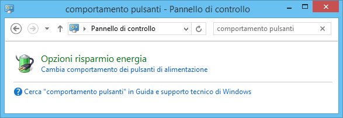

Accedendo al Pannello di controllo di Windows e ricercando **comportamento pulsanti** è possibile raggiungere la schermata di configurazione delle impostazioni di spegnimento del sistema.

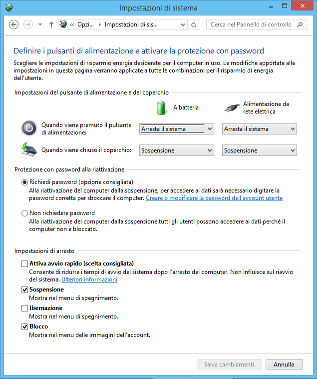

Basterà togliere la spunta in fondo su **Attiva avvio rapido (scelta consigliata)**. Se l'impostazione dovesse risultare bloccata cliccare il collemento in alto **Modifica le impostazioni attualmente non disponibili**.

----

# Preparazione di Arch Linux su USB

Per installare Arch Linux è necessario utilizzare un pendrive USB da almeno 1 GiB opportunamento preparato. **Attenzione** poiché tutti i dati nel dispositivo USB verranno irrimediabilmente cancellati.

Scaricare innanzitutto l'immagine ISO di installazione di Arch Linux dal sito <https://www.archlinux.org/download/> (ad oggi si tratta del file archlinux-2015.06.01-dual.iso).

Scaricare anche lo strumento Rufus dal sito <https://rufus.akeo.ie/>. Va bene anche la versione portable (ad oggi si tratta di rufus-2.2p.exe), che funziona su Windows anche senza installazione.

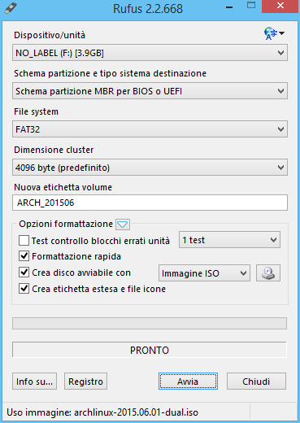

Inserire un dispositivo USB da almeno 1 GiB, avviare quindi Rufus, cliccare l'icona del lettore CD, scegliere il file ISO di Arch Linux scaricato in precedenza e avviare la scrittura del file ISO nel pendrive cliccando su **Avvia**.

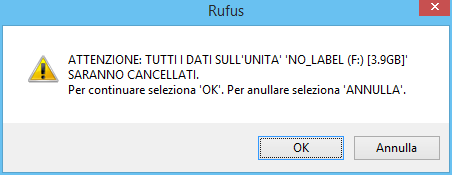

Confermare la totale cancellazione di tutti i dati nel dispositivo USB e attendere il completamento della scrittura.

----

# Avviare il sistema tramite USB

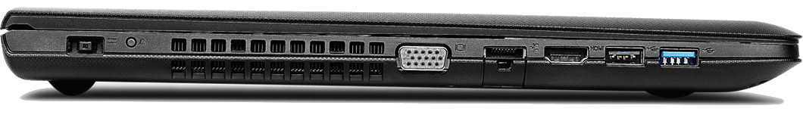

Spegnere (non riavviare) il sistema e una volta spento premere il pulsante **OneKey** posto sul lato sinistro del computer.

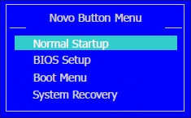

Dal menu che sarà mostrato scegliere la voce **Boot Menu**, confermare con invio, nella schermata del Boot Manager scegliere l'avvio da **EFI USB Device (Generic USB Storage)** o una voce similare che parli di USB e confermare con invio.

----

# Firmare i kernel con HashTool

Poiché in questa configurazione è attivo il [Secure Boot] è necessario firmare tutti i sistemi operativi che si desidera eseguire.

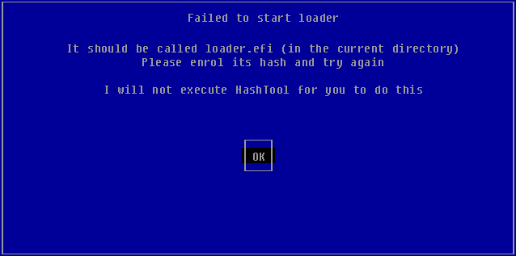

Verrà immediatamente presentato un messaggio di errore riguardo il file **loader.efi** che non risulta firmato. Confermare con OK per accedere a **HashTool**, lo strumento che consente di firmare i sistemi operativi da avviare.

La procedura è semplice e richiede la firma dei file **loader.efi** (il programma di avvio da USB di Arch Linux) e **vmlinuz** (il kernel Linux avviato da USB per l'installazione di Arch Linux).

Questa procedura di firma è detta **Enrolling** e tramite HashTool consente di calcolare un valore detto Hash ed aggiungerlo al database delle chiavi macchina (MOK = Machine Owner Keys) autorizzate.

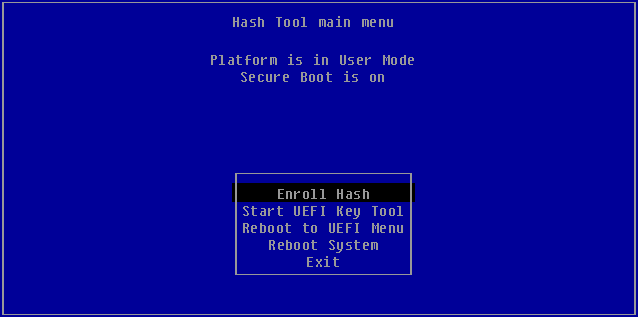

Selezionando **Enroll Hash** si procede a firmare i due file necessari.

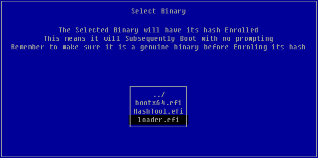

Scegliere inizialmente il file **loader.efi** nella directory \EFI.

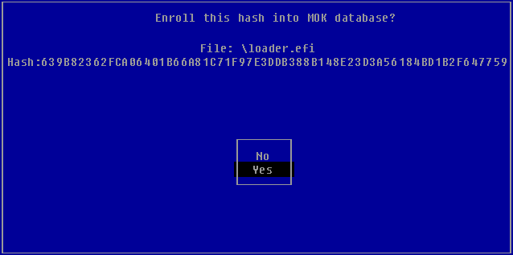

Confermare con Yes la firma del file selezionato.

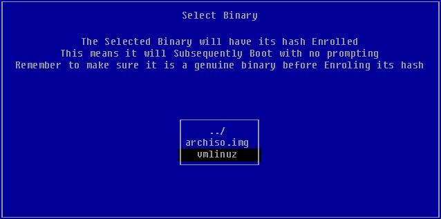

Firmare successivamente il file **vmlinuz** nella directory \arch\boot\x86_64

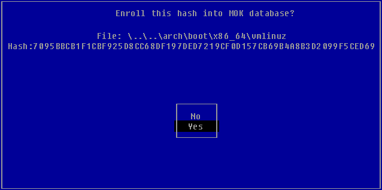

Confermare la firma di questo secondo file e al termine uscire da HashTool scegliendo l'opzione **Exit**.

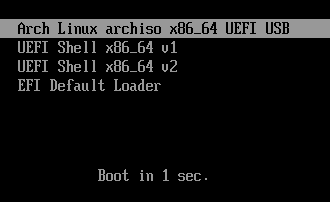

Dopo alcuni secondi sarà mostrato il menu di avvio dell'immagine di installazione di Arch Linux, scegliere la prima voce **Arch Linux archiso x86_64 UEFI USB** e avviare con invio.

Se venissero mostrati errori riguardo software non firmati, assicurarsi di aver firmato entrambi i file loader.efi e vmlinuz.

Effettuata questa operazione sarà avviata la procedura di installazione di Arch Linux, consultare la guida [Installation guide] per ulteriori informazioni sul processo di installazione.

Sin dal primo avvio dell'installazione di Arch Linux sarà automaticamente utilizzata la tastiera in lingua americana (<kbd>Maiusc</kbd>+<kbd>2</kbd> rappresenterà la @ anziché le virgolette "). Se si desidera impostare sin da subito la tastiera italiana eseguire il comando **loadkeys it** .

    root@archiso ~ # loadkeys it

[Secure Boot]: https://msdn.microsoft.com/it-it/library/hh824987.aspx "Panoramica di Secure Boot"
[Installation guide]: https://wiki.archlinux.org/index.php/Installation_guide