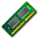
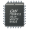

Il gestore di avvio rEFInd offre numerose possibilità e con molta semplicità permette l'avvio di sistemi operativi differenti.

Il suo funzionamento è assai semplice e generalmente basta spostarsi con le freccette e confermare la scelta premendo Invio. E' anche possibile premere il tasto corrispondente al numero del sistema da avviare, 1 per la prima icona visualizzata, 2 per la seconda e così via.

Nella finestra di rEFInd sono visibili varie icone.

# Icone dei sistemi avviabili

La prima fila di icone rappresenta un sistema operativo avviabile.

|**Icona**                   |**Significato**                                  |
|----------------------------|:------------------------------------------------|
|     |Indica l'avvio di un sistema Arch Linux          |
|    |Indica l'avvio di un generico sistema GNU/Linux  |
|      |Indica l'avvio di un sistema Microsoft Windows   |
|     |Indica l'avvio di un sistema Microsoft Windows 8 |
|  |Indica l'avvio di un sistema operativo generico  |
| |Scorre l'elenco dei sistemi verso destra         |
|  |Scorre l'elenco dei sistemi verso sinistra       |

L'elenco delle icone dei sistemi operativi non si esaurisce qui ma ne esistono anche tante altre disponibili nella directory icons di rEFInd.

Premendo **F2** sopra un sistema avviabile saranno mostrate opzioni aggiuntive riguardo l'avvio, come la modalità single.

Premendo **ESC** in qualsiasi parte viene aggiornato l'elenco dei sistemi rilevati.

# Icone aggiuntive dei sistemi avviabili

Nell'angolo destro di ogni icona di un sistema avviabile è presente un'icona aggiuntiva che indica dove si trovi il sistema operativo da avviare.

|**Icona**                    |**Significato**                                  |
|-----------------------------|:------------------------------------------------|
| |Indica un sistema avviato da un disco interno    |
|  |Indica un sistema avviato da un'unità ottica     |
| |Indica un sistema avviato da un disco esterno    |
|      |Indica un sistema avviato da rete                |

# Icone delle utilità aggiuntive

La fila di icone in basso rappresenta una serie di utilità aggiuntive. Quelle non supportate o non disponibili non saranno mostrate.

|**Icona**                           |**Significato**                                  |
|------------------------------------|:------------------------------------------------|
| |Avvia la partizione di ripristino di Windows     |
|       |Avvia uno degli strumenti di firma di PreLoader  |
|        |Avvia l'utilità di controllo della memoria RAM   |
|          |Avvia una shell EFI                              |
|          |Mostra le informazioni sulla versione di rEFInd  |
|       |Spegne il computer                               |
|          |Riavvia il computer                              |
|           |Esce da rEFInd e torna alla Shell EFI            |
|       |Avvia l'utilità di configurazione di UEFI        |
