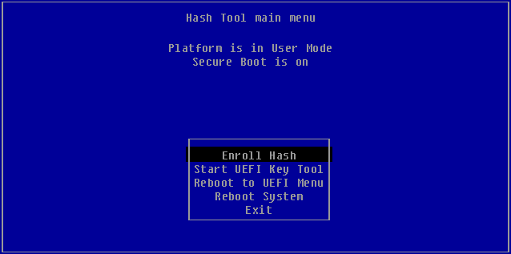

Avviando per la prima volta Arch Linux dal menu di rEFInd sarà mostrato un avviso riguardo un errore di Secure Boot per il kernel **vmlinux-linux**.

**Secure Boot validation failure loading vmlinuz-linux!**

Il messaggio di errore fornisce anche la soluzione, utilizzare l'utilità MOK per registrare il file vmlinuz-linux. Premendo un tasto qualsiasi si tornerà a rEFInd.

 **Start MOK utility at EFI\refind\HashTool.efi on SYSTEM_DRV**

Dalla seconda riga utilizzare l'icona per aggiungere un file al database MOK.

Sarà mostrato nuovamente il menu di **HashTool**, già visto durante la fase di [preparazione](../preparazione-del-sistema).

Scegliere quindi la voce dal menu **Enroll Hash** e selezionare il file **vmlinuz-linux** posto sulla radice della partizione. Quando richiesto  (**Enroll this hash into MOK database?**) rispondere confermando su **Yes** e al termine uscire dall'utilità scegliendo **Exit**.

Ritornati al menu di rEFInd sarà adesso possibile avviare Arch Linux normalmente.