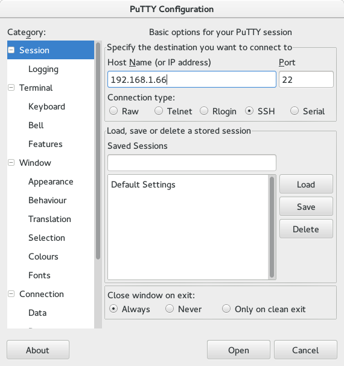
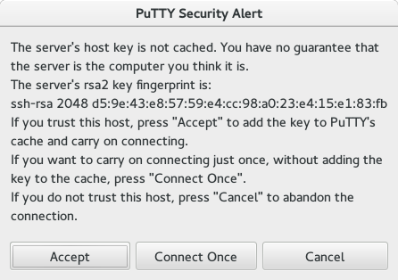

Se si utilizza un altro dispositivo, sia esso dotato di sistema operativo GNU/Linux oppure Microsoft Windows o anche Apple OS X e perfino sistemi mobili come Android o iOS, è possibile accedere alla propria installazione tramite la rete utilizzando il protocollo [Secure Shell] (SSH).

## Installazione del servizio SSH

Per installare il servizio SSH è necessario installare il pacchetto **openssh**

    [root@arch-lenovo ~]# pacman -S openssh
    risoluzione delle dipendenze in corso...
    ricerca dei pacchetti in conflitto in corso...

    Pacchetti (4) dnssec-anchors-20150403-1  ldns-1.6.17-2  libedit-20150325_3.1-1  openssh-6.8p1-3

    Dimensione totale dei pacchetti da scaricare:   1,20 MiB
    Dimensione totale dei pacchetti da installare:  6,25 MiB

    :: Vuoi procedere con l'installazione? [S/n] 
    :: Download dei pacchetti in corso...
     libedit-20150325_3.1-1-x86_64       92,8 KiB   248K/s 00:00 [####################################] 100%
     dnssec-anchors-20150403-1-x86_64  1460,0   B  0,00B/s 00:00 [####################################] 100%
     ldns-1.6.17-2-x86_64               429,6 KiB   223K/s 00:02 [####################################] 100%
     openssh-6.8p1-3-x86_64             703,0 KiB   222K/s 00:03 [####################################] 100%
    (4/4) verifica delle chiavi presenti nel portachiavi         [####################################] 100%
    (4/4) verifica dell'integrità dei pacchetti                  [####################################] 100%
    (4/4) caricamento dei file dei pacchetti                     [####################################] 100%
    (4/4) controllo dei conflitti in corso                       [####################################] 100%
    (4/4) controllo dello spazio disponibile sul disco           [####################################] 100%

    (1/4) installazione di libedit in corso...                   [####################################] 100%
    (1/4) installazione di dnssec-anchors in corso...            [####################################] 100%
    (3/4) installazione di ldns in corso...                      [####################################] 100%
    Dipendenze opzionali di ldns
        libpcap: ldns-dpa tool
    (4/4) installazione di openssh in corso...                   [####################################] 100%
    Dipendenze opzionali di openssh
        xorg-xauth: X11 forwarding
        x11-ssh-askpass: input passphrase in X

## Attivazione del servizio SSH

Il servizio appena installato non sarà automaticamente avviato né subito né dopo il riavvio del sistema.

Per avviare manualmente il servizio SSH è possibile utilizzare [systemd](../systemd) e in particolare il comando **systemctl start sshd.service**

    [root@arch-lenovo ~]# systemctl start sshd.service

Per avviare automaticamente il servizio SSH dopo ogni avvio del sistema utilizzando **systemctl enable sshd.service**

    [root@arch-lenovo ~]# systemctl enable sshd.service
    Created symlink from /etc/systemd/system/multi-user.target.wants/sshd.service to /usr/lib/systemd/sshd.service.

Dopo l'avvio del servizio SSH, da un'altra postazione, indipendentemente dal
suo sistema operativo sarà possibile connettersi al nostro sistema Arch Linux
utilizzando un qualsiasi [client SSH].

### Client SSH per Microsoft Windows:

* [Putty]
* [Bitvise SSH Client]
* [SecureCRT]
* [ZOC]
* [Token2Shell]

### Client SSH per GNU/Linux

* [Putty]
* [PAC Manager]
* [SecureCRT]
* OpenSSH (solo a riga di comando)

### Client SSH per Apple OS X

* [SecureCRT]
* [ZOC]

### Client SSH per iOS

* [SecureCRT]

### Client SSH per Android

* [ConnectBot]
* [JuiceSSH]

### Client SSH per Windows Phone

* [Token2Shell]

## Recuperare l'indirizzo IP della connessione di rete

Prima di poter accedere al proprio sistema è necessario conoscere l'indirizzo IP che l'installazione di Arch Linux ha ricevuto tramite rete WiFi.

Per conoscere il proprio indirizzo IP utilizzare il comando **ip addr**:

    [root@arch-lenovo ~]# ip addr
    1: lo: <LOOPBACK,UP,LOWER_UP> mtu 65536 qdisc noqueue state UNKNOWN group default 
        link/loopback 00:00:00:00:00:00 brd 00:00:00:00:00:00
        inet 127.0.0.1/8 scope host lo
           valid_lft forever preferred_lft forever
        inet6 ::1/128 scope host 
           valid_lft forever preferred_lft forever
    2: enp1s0: <BROADCAST,MULTICAST> mtu 1500 qdisc noop state DOWN group default qlen 1000
        link/ether 28:d2:44:cd:25:b7 brd ff:ff:ff:ff:ff:ff
    3: wlp2s0: <BROADCAST,MULTICAST,UP,LOWER_UP> mtu 1500 qdisc mq state UP group default qlen 1000
        link/ether b0:10:41:a2:ab:87 brd ff:ff:ff:ff:ff:ff
        inet 192.168.1.66/24 brd 192.168.1.255 scope global wlp2s0
           valid_lft forever preferred_lft forever
        inet6 fda6:d284:bb8b:0:b210:41ff:fea2:ab87/64 scope global mngtmpaddr dynamic 
           valid_lft 7185sec preferred_lft 1785sec
        inet6 fe80::b210:41ff:fea2:ab87/64 scope link 
           valid_lft forever preferred_lft forever

Saranno mostrati tutti gli indirizzi di tutte le interfacce di rete. Per vedere l'indirizzo della sola interfaccia WiFi utilizzare il comando **ip -4 addr show dev wlp2s0**

    [root@arch-lenovo ~]# ip -4 addr show dev wlp2s0
    3: wlp2s0: <BROADCAST,MULTICAST,UP,LOWER_UP> mtu 1500 qdisc mq state UP group default qlen 1000
        inet 192.168.1.66/24 brd 192.168.1.255 scope global wlp2s0
           valid_lft forever preferred_lft forever

La risposta mostrerà l'indirizzo che la scheda WiFi sta utilizzando, in questo caso si tratta di **192.168.1.66**.

## Accedere al proprio Lenovo utilizzando la riga di comando

E' possibile accedere al proprio sistema Lenovo utilizzando un'altra distribuzione GNU/Linux utilizzando la riga di comando con un semplice comando:

    [muflone@archbox ~]$ ssh root@192.168.1.66
    
    The authenticity of host '192.168.1.66 (192.168.1.66)' can't be established.
    ECDSA key fingerprint is SHA256:deuxH032JgG+OSkTjL+7pY6V3pJCGErcthsG7yxrgQc.
    Are you sure you want to continue connecting (yes/no)? yes
    Warning: Permanently added '192.168.1.66' (ECDSA) to the list of known hosts.
    root@192.168.1.66's password: 
    
    [root@arch-lenovo ~]# 

## Accedere al proprio Lenovo utilizzando Putty

Viene mostrato un esempio di accesso al proprio notebook Lenovo utilizzando [Putty] ma il procedimento è analogo a qualsiasi altro applicativo si decidesse di utilizzare.

Quando richiesto inserire nel campo **Host Name (or IP Address)** l'indirizzo della macchina, nel nostro esempio 192.168.1.66 e cliccare su Open per instaurare la connessione.

Verrà richiesto di verificare l'identità del server cui ci si connette, cliccare su **Accept**.

Infine quando verrà richiesto, inserire il nome utente **root** e la password decisa in fase di installazione.

Tramite questa sessione di terminale sarà possibile impartire qualsiasi comando (non grafico) tramite un'altra postazione di lavoro e eseguire la manutenzione del sistema Lenovo attraverso un'altra postazione.

[Secure Shell]: https://wiki.archlinux.org/index.php/Secure_Shell "Secure Shell"
[client SSH]: https://en.wikipedia.org/wiki/Comparison_of_SSH_clients "Comparison of SSH clients"
[Putty]: http://www.chiark.greenend.org.uk/~sgtatham/putty/
[Bitvise SSH Client]: http://www.bitvise.com/ssh-client
[SecureCRT]: https://www.vandyke.com/products/securecrt/index.html
[PAC Manager]: https://sourceforge.net/projects/pacmanager/
[ZOC]: http://www.emtec.com/zoc/
[ConnectBot]: https://connectbot.org/
[JuiceSSH]: https://juicessh.com/
[Token2Shell]: http://choung.net/token2shell/